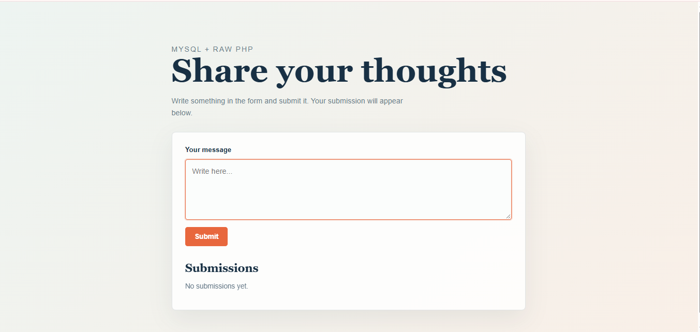

<h1 align="center"> 🐳 Dockerized PHP Form on AWS</h1>

A simple raw-PHP form project, containerized with Docker and deployed on AWS EC2 which is built while learning core DevOps concepts like environment configuration, container networking, database injection, and CI/CD.




## 📌 Overview

This project started as a basic raw-PHP form where a user can submit some text. The real learning, however, came from **dockerizing** and **deploying** it on AWS  and everything that broke along the way.

## 🛠️ Tech Stack

| Layer | Technology |
|---|---|
| Backend | Raw PHP |
| Database | MySQL |
| Containerization | Docker |
| Hosting | AWS EC2 |
| Config | Docker Environment Variables |

## 🚧 Challenges Faced & How I Solved Them

| # | Problem | Root Cause | Fix |
|---|---|---|---|
| 1 | App didn't load via AWS public IP | `EXPOSE` port in the `Dockerfile` didn't match the port actually being used | Checked EC2 inbound rules first, then traced it back to a port mismatch in the `Dockerfile` and corrected it |
| 2 | App broke inconsistently between local and container | Environment variables were set differently in the PHP file vs. at container creation | Synced the environment variable values in both places |

## 💡 What I Learned

- **Injecting SQL into a running container**
  Ran a `.sql` file directly into a live MySQL container:
  ```bash
  docker exec -i mysql mysql -u root -proot form_app < init.sql
  ```
  Docker *warned* that passing the password inline on the command line isn't secure. As a safer alternative, I found I could copy `init.sql` into the container's `/tmp` folder and run it from inside a `bash` shell instead avoiding the password ever being passed as a plain CLI argument.

- **Why CI/CD exists**
  Every time I changed `index.php`, I had to manually stop, remove, rebuild, and rerun the container. Asking around led me to CI/CD pipelines I'd heard the term before, but this was the first time I understood *why* it exists: to remove exactly this kind of repetitive manual work.

## 🚀 How to Run

```bash
# Build the image
docker build -t php-form-app .

# Run the container
docker run -d -p 80:80 --env-file .env --name php-form php-form-app

# Seed the database
docker exec -i mysql mysql -u root -proot form_app < init.sql
```
---
